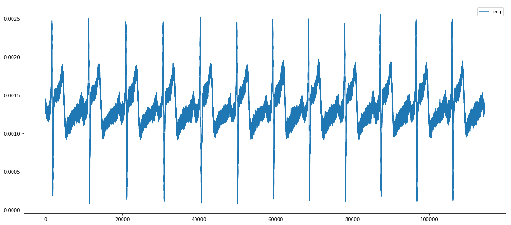
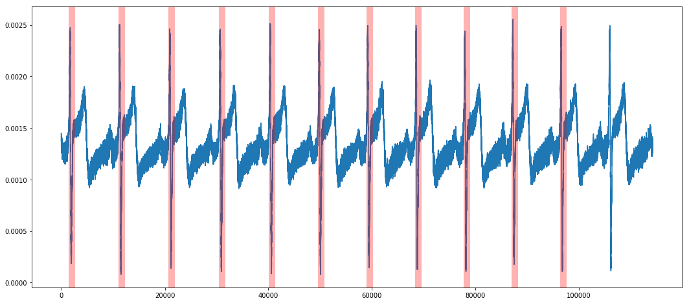

# ECG_Signal_processing-
QRS Detection:

The QRS complex is the most prominent feature in ECG signal and is therefore useful for quantifying timing of individual heartbeats. This allows for quantifying useful physiological metrics such as R-R interval, heart rate, heart rate variability as well as providing timing for measurement of other cardiovascular signals such as beat-to-beat systolic/diastolic blood pressure, brain blood flow velocity or muscle sympathetic nerve activity.

The ecg_wavelet() class in ecg_processing.py provides a [Butterworth_filter](https://en.wikipedia.org/wiki/Butterworth_filter)for noise removal and QRS detection via [wavelet transform](https://en.wikipedia.org/wiki/Wavelet_transform).
 The .get_qrs() method returns a dataframe including a column labeling each detected QRS timepoint.

